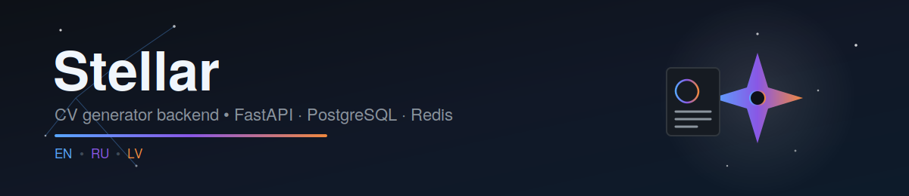
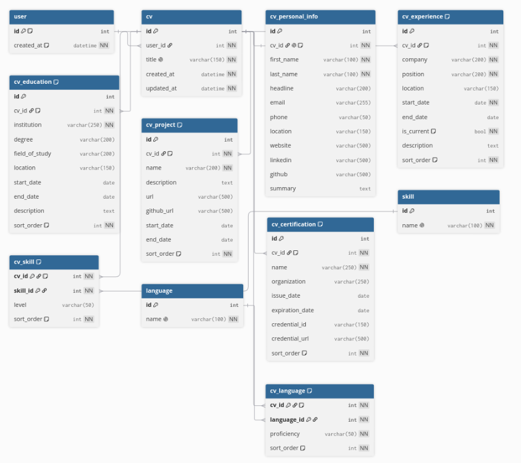

<div align="center">



# Stellar

**Backend for a resume builder — full CRUD across all CV sections and PDF export using customizable templates.**

[](https://www.python.org/)
[](https://fastapi.tiangolo.com/)
[](https://sqlmodel.tiangolo.com/)
[](https://www.postgresql.org/)
[](https://redis.io/)
[](https://www.docker.com/)
[](https://jwt.io/)
[](LICENSE)

Templates: `classic` `modern` `minimal` `executive` `editorial` `timeline`
Languages: `en` · `ru` · `lv`

</div>

---

## Overview

**Stellar** is a REST API built on FastAPI for structured resume creation. Users populate a CV
step by step — personal information, work experience, education, skills, languages, projects,
and certifications — and then generate a finished PDF by selecting one of six visual templates
and one of three resume languages: English, Russian, or Latvian.

## Features

- **CV CRUD** — creation, paginated search, updates, deletion
- **Personal information** — name, contact details, social profiles, professional summary
- **Work experience** and **education** with dates, descriptions, and custom ordering of entries
- **Skills** and **languages** — reusable reference catalogs linked to a CV with proficiency levels
- **Projects** and **certifications** with links to supporting credentials
- **PDF generation** — 6 layout templates × 3 locales
- **Statistics** on CV counts and section completeness
- **JWT authentication** with local caching of user data extracted from the token
- **Redis** for caching and queues; all persistent data is stored in **PostgreSQL** via SQLModel

## Technology Stack

| Layer            | Technology                     |
|-------------------|--------------------------------|
| Language          | Python 3.14                    |
| Web framework     | FastAPI + Uvicorn              |
| ORM               | SQLModel (SQLAlchemy)          |
| Database          | PostgreSQL 18                  |
| Cache             | Redis 8                        |
| Authentication    | JWT (HS256)                    |
| PDF generation    | WeasyPrint (Pango/HarfBuzz)    |
| Containerization  | Docker / Docker Compose        |

## Quick Start

```bash
git clone <repo-url> stellar
cd stellar
cp .env.example .env   # fill in the environment variables, see table below
docker compose up --build -d
```

Once running, the service is available at **http://localhost:8001**, with interactive
documentation at **http://localhost:8001/docs**.

PostgreSQL is exposed on host port `5440`, Redis on `6380` (see `docker-compose.yml`).

## Environment Variables

| Variable                | Description                          | Example                   |
|--------------------------|----------------------------------------|---------------------------|
| `POSTGRES_HOST`          | Database host                         | `stellar_db`              |
| `POSTGRES_PORT`          | Database port                         | `5432`                    |
| `POSTGRES_DB`            | Database name                         | `stellar`                 |
| `POSTGRES_USER`          | Database user                         | `admin`                   |
| `POSTGRES_PASSWORD`      | Database password                     | `••••••••`                |
| `REDIS_HOST`             | Redis host                            | `stellar_redis`           |
| `REDIS_PORT`             | Redis port                            | `6379`                    |
| `REDIS_DB`               | Redis logical database number         | `0`                       |
| `REDIS_PASSWORD`         | Redis password (if set)               | ` `                       |
| `JWT_SECRET_KEY`         | Secret used to sign JWTs              | `••••••••`                |
| `JWT_ALGORITHM`          | JWT signing algorithm                 | `HS256`                   |

> **Note:** Do not use the sample values from `docker-compose.yml` in production — set your own
> strong secrets for `POSTGRES_PASSWORD` and `JWT_SECRET_KEY`.

## API Reference

All endpoints (except `/statistics`, which defines its own security scheme) are protected via
`HTTPBearer` — pass the JWT in the `Authorization: Bearer <token>` header.

| Section | Methods | Base path |
|---|---|---|
| **CV** | `POST` `GET` `/cvs`, `GET` `PATCH` `DELETE` `/cvs/{cv_id}` | resumes and paginated search |
| **CV Personal Info** | `POST` `PATCH` `DELETE` `/cvs/{cv_id}/personal-info` | CV personal information |
| **CV Experience** | `POST` `/cvs/{cv_id}/experiences`, `PATCH` `DELETE` `/cvs/{cv_id}/experiences/{id}` | work experience |
| **CV Education** | `POST` `/cvs/{cv_id}/education`, `PATCH` `DELETE` `/cvs/{cv_id}/education/{id}` | education |
| **Skills** | `POST` `GET` `/skills`, `GET` `/skills/{id}`, `POST` `/cvs/{cv_id}/skills`, `PATCH` `DELETE` `/cvs/{cv_id}/skills/{id}` | skills reference catalog and CV linking |
| **CV Projects** | `POST` `/cvs/{cv_id}/projects`, `PATCH` `DELETE` `/cvs/{cv_id}/projects/{id}` | projects |
| **Languages** | `POST` `GET` `/languages`, `GET` `/languages/{id}`, `POST` `/cvs/{cv_id}/languages`, `PATCH` `DELETE` `/cvs/{cv_id}/languages/{id}` | languages reference catalog and CV linking |
| **CV Certifications** | `POST` `/cvs/{cv_id}/certifications`, `PATCH` `DELETE` `/cvs/{cv_id}/certifications/{id}` | certifications |
| **CV Generator** | `POST` `/cvs/{cv_id}/generate` | PDF generation by `template` and `language` |
| **Statistics** | `GET` `/statistics` | aggregated statistics for the user's CVs |

The full specification is available in `openapi.json` or at `/docs` on the running service.

## Database Schema

<div align="center">



</div>

The schema is centered on the `cv` table, which references `user` and owns all child resume
sections (`ON DELETE CASCADE`). `skill` and `language` are reusable reference catalogs, linked to
a CV through the association tables `cv_skill` and `cv_language`, each using a composite primary key.

The file [`schema.dbml`](./schema.dbml) can be pasted directly into
**[dbdiagram.io](https://dbdiagram.io)** to produce an interactive, editable diagram.

<details>
<summary>Tables</summary>

| Table | Purpose |
|---|---|
| `user` | local reference to the user, ID sourced from the JWT |
| `cv` | user resumes; `title` is unique |
| `cv_personal_info` | personal information, 1:1 with `cv` |
| `cv_experience` | work experience |
| `cv_education` | education |
| `cv_project` | projects |
| `cv_certification` | certifications |
| `skill` / `cv_skill` | skills catalog and many-to-many relation with proficiency level |
| `language` / `cv_language` | languages catalog and many-to-many relation with proficiency level |

</details>

## Project Structure

```
stellar/
├── app/
│   ├── main.py
│   ├── models/          # SQLModel models (User, CV, CVExperience, ...)
│   ├── routers/          # FastAPI endpoints
│   ├── schemas/          # Pydantic Create/Read/Update schemas
│   └── ...
├── requirements.txt
├── Dockerfile
├── docker-compose.yml
└── .env
```

## License

This project is distributed under the **MIT License** — see the [`LICENSE`](LICENSE) file for details.

---

<div align="center">
<sub>Built with FastAPI</sub>
</div>